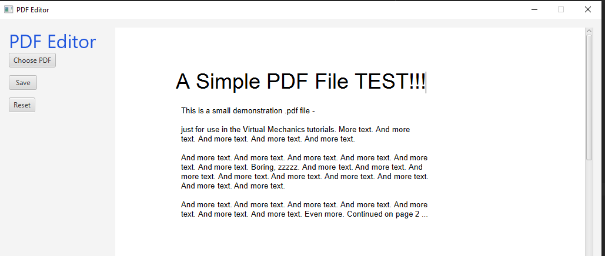
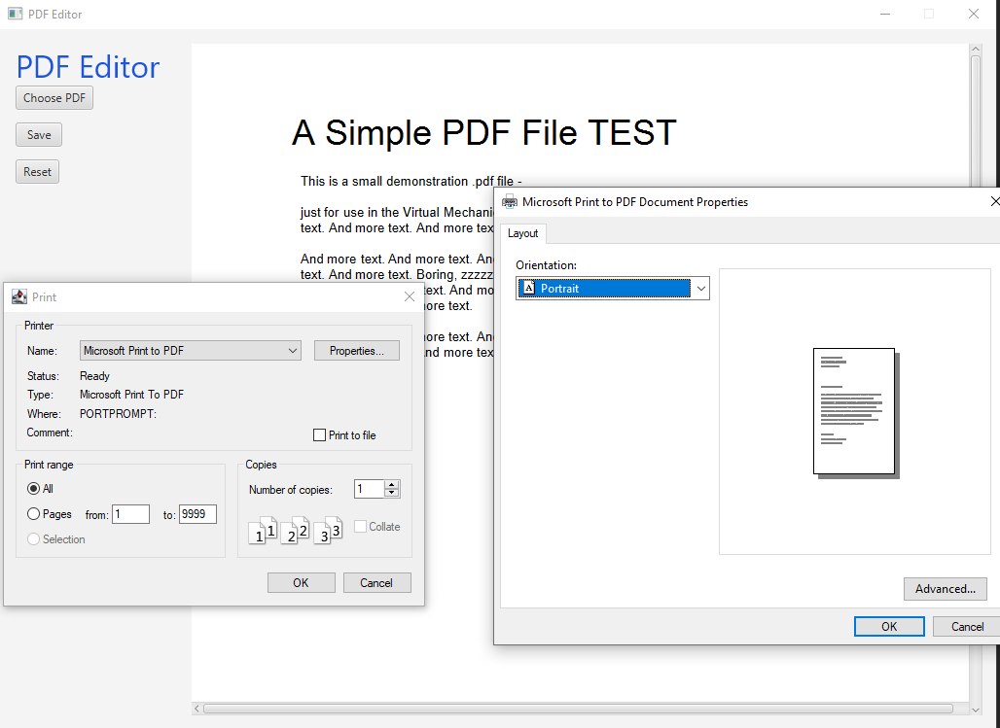
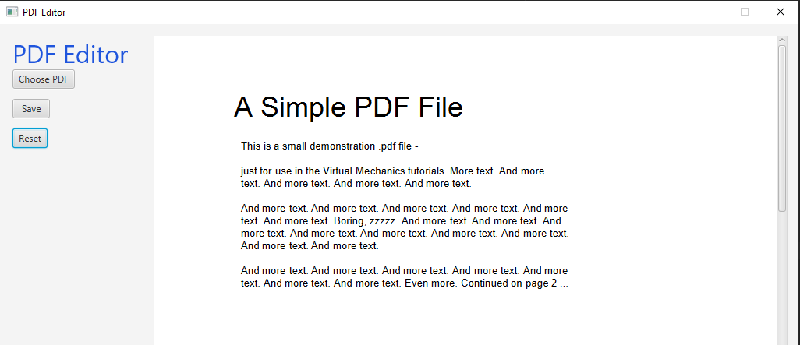
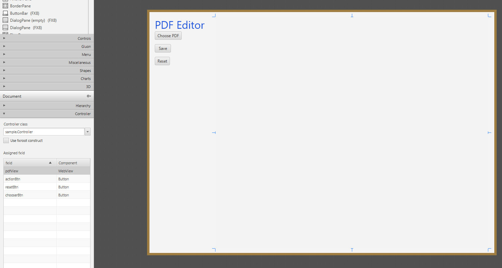

# PDF Editor with JavaFX
In this guide you will learn how to build a PDF editor in JAVA.
 The idea has come to me when I helped my granddad to submit the declaration to the tax agency, 
 and instead of annually fill the form again and again I used to change a couple of fields by 
 from **PDF** to **DOC** and back. It slightly could ruin the layout, and my student license
 has been expired. Buying extension for any PDF editor or use online resources I did not want, 
 so I decided to build my own editor with Java. It was fun,
  and I gain a lot of knowledge during working on this project. I hope you will find this useful too.  
  
# Example how it works:
Find example PDF in *src/sample/sample.PDF*
1. Select file

2. Edit document

3. Save/pring document and choose a layout of PDF

4. Restore document
  
  
# Set-up
Firstly, I recommend you to cover [this](https://github.com/ifarkhshatov/JavaFXTutorial) lesson to be able to create an empty JavaFx app.
Besides, JavaFx we also need two libraries. (also please adjust VM option to add aditionally javafx.web at the end.)
1. **PDFtoHTML** - to convert PDF file to HTML and be able to edit the document. (see [this](http://cssbox.sourceforge.net/pdf2dom/download.php))
2. **Jsoup** - to parse HTML document and add additional data to elements of this HTML. (see [this](https://jsoup.org/download))


After you have added .jar files to the library of the project. We can start to build our app.

# Steps
Here are rough steps of what to do:
1. In SceneBuilder open *.fxml* and build a basic layout. For example:  

1.1 I generally create three buttons which are responsible for choose the right PDF; store edited file and restore changes.  
1.2 The area where we will build our app is called WebView and uses for displaying web-pages. I decided to use WebView 
for its minimalism rather than use HTMLEditor (but you can use that if you want).
2. Write a function which will convert *.PDF* to *.HTML*.  
2.1 I place this function in Controller.java, here is a code (below)  
2.2 In the function I create an output **"backup.html"** to be able to restore it if I ruin pdf while editing.  

```Java
    public static void generateHTMLFromPDF(PDDocument pdf) throws IOException, ParserConfigurationException {
        Writer output = new PrintWriter("./src/output/backup.html", StandardCharsets.UTF_8);
        new PDFDomTree().writeText(pdf, output);
        output.close();
        pdf.close();
    }
```  

3. Create an observer menu (choosing files)  
3.1 I placed it under choose button (chooserBtn) in **initialize()** function: (below)  
3.2 The reaction is following: when I click a button, Java call file chooser of OS to be able select file.
 I also limited extensions of files in **FileChooser.ExtensionFilter**   
```Java
        chooserBtn.setOnAction(actionEvent -> {
            FileChooser fileChooser = new FileChooser();
            FileChooser.ExtensionFilter extFilter = new FileChooser.ExtensionFilter("PDF", "*.pdf","*.PDF");
            fileChooser.getExtensionFilters().add(extFilter);
            File file = fileChooser.showOpenDialog(chooserBtn.getScene().getWindow());
        });
```

4. Create a class for additional information to DOM objects.  
    4.1 I create a class named **HtmlEditor.java**, there I add function **EditHTML()** which slightly adjust HTML to be editable:  
    4.2 DOM object can be editable when attribute **contenteditable = true**, so I place it in the element **`<BODY>`**  
    4.3 I add CSS styling to ignore width which is set **inline** for each  element.  
    4.4 I add printing formation and hide border of page element.
    
```Java
    public String EditHTML() throws IOException {
        File input = new File(this.source);

        Document doc = Jsoup.parse(input, "UTF-8");

        doc.select("body").attr("contenteditable","true");
        doc.select("head").prepend("<style type=\"text/css\">div.p{width:auto!important;}   .page{border: 1px transparent!important;}  @page {\n" +
                "        size: auto;\n" +
                "        margin: 0;\n" +
                "    }\n" +
                "    @media print {\n" +
                "        html, body {\n" +
                "            width: 210mm;\n" +
                "            height: 297mm;        \n" +
                "        }\n" +
                "        .page {\n" +
                "            margin: 0;\n" +
                "            border: initial;\n" +
                "            border-radius: initial;\n" +
                "            width: initial;\n" +
                "            min-height: initial;\n" +
                "            box-shadow: initial;\n" +
                "            background: initial;\n" +
                "            page-break-after: always;\n" +
                "        }\n" +
                "    }");

        doc.outputSettings().syntax(Document.OutputSettings.Syntax.xml);
        return doc.html();
    }
```
 
5. Finish code for choose button:  
5.1 Now when file is chosen it is converting to HTML; getting attributes above and display in WebView
```Java
        chooserBtn.setOnAction(actionEvent -> {
            FileChooser fileChooser = new FileChooser();
            FileChooser.ExtensionFilter extFilter = new FileChooser.ExtensionFilter("PDF", "*.pdf","*.PDF");
            fileChooser.getExtensionFilters().add(extFilter);
            File file = fileChooser.showOpenDialog(chooserBtn.getScene().getWindow());

            if (file != null) {
            PDDocument pdf = null;


            try {
                pdf = PDDocument.load(file);
                generateHTMLFromPDF(pdf);
                HtmlEditor htmlEditor = new HtmlEditor("./src/output/backup.html");
                render.loadContent(htmlEditor.EditHTML(),"text/html");
            } catch (IOException | ParserConfigurationException e) {
                e.printStackTrace();
            }

        }
        });
```

6. Finish **initialize()** function and add reaction to other buttons:  
6.1 At the beginning of the function we state WebEngine object  
6.2 For reset button we just call **backup.html** to be viewed in WebEngine again
6.3 For save option (actionBtn) we just call new Print job to be able either print or store it as PDF file
```Java
 @FXML
    void initialize() throws IOException, ParserConfigurationException {

        WebEngine render = pdfView.getEngine();
        chooserBtn.setOnAction(actionEvent -> {
            FileChooser fileChooser = new FileChooser();
            FileChooser.ExtensionFilter extFilter = new FileChooser.ExtensionFilter("PDF", "*.pdf","*.PDF");
            fileChooser.getExtensionFilters().add(extFilter);
            File file = fileChooser.showOpenDialog(chooserBtn.getScene().getWindow());

            if (file != null) {
            PDDocument pdf = null;


            try {
                pdf = PDDocument.load(file);
                generateHTMLFromPDF(pdf);
                HtmlEditor htmlEditor = new HtmlEditor("./src/output/backup.html");
                render.loadContent(htmlEditor.EditHTML(),"text/html");
            } catch (IOException | ParserConfigurationException e) {
                e.printStackTrace();
            }

        }
        });

        actionBtn.setOnAction(actionEvent -> {
            System.out.println("Stored file");

            PrinterJob job = PrinterJob.createPrinterJob();
            job.showPrintDialog(actionBtn.getScene().getWindow());
            render.print(job);
            job.endJob();
        });

        resetBtn.setOnAction(actionEvent -> {
            HtmlEditor htmlEditor = new HtmlEditor("./src/output/backup.html");
            try {
                pdfView.getEngine().loadContent(htmlEditor.EditHTML(),"text/html");
            } catch (IOException e) {
                e.printStackTrace();
            }
        });
    }
```
7. It should work!

# Full code for Controller.java
```Java
package sample;

import java.io.*;
import java.net.URL;
import java.nio.charset.StandardCharsets;
import java.nio.file.Files;
import java.nio.file.Path;
import java.util.ResourceBundle;

import javafx.beans.property.ReadOnlyObjectProperty;
import javafx.fxml.FXML;
import javafx.print.Printer;
import javafx.print.PrinterJob;
import javafx.scene.control.Button;
import javafx.scene.web.HTMLEditor;
import javafx.scene.web.WebEngine;
import javafx.scene.web.WebHistory;
import javafx.scene.web.WebView;
import javafx.stage.FileChooser;
import org.apache.pdfbox.pdmodel.PDDocument;
import org.fit.pdfdom.PDFDomTree;
import org.w3c.dom.Document;

import javax.print.PrintService;
import javax.xml.parsers.ParserConfigurationException;
import javax.xml.transform.Transformer;
import javax.xml.transform.TransformerException;
import javax.xml.transform.TransformerFactory;
import javax.xml.transform.dom.DOMSource;
import javax.xml.transform.stream.StreamResult;

public class Controller {

    @FXML
    private ResourceBundle resources;

    @FXML
    private URL location;


    @FXML
    private WebView pdfView;

    @FXML
    private Button actionBtn;

    @FXML
    private Button resetBtn;

    @FXML
    private Button chooserBtn;


    public static void generateHTMLFromPDF(PDDocument pdf) throws IOException, ParserConfigurationException {
        Writer output = new PrintWriter("./src/output/backup.html", StandardCharsets.UTF_8);
        new PDFDomTree().writeText(pdf, output);
        output.close();
        pdf.close();
    }

    @FXML
    void initialize() throws IOException, ParserConfigurationException {

        WebEngine render = pdfView.getEngine();
        chooserBtn.setOnAction(actionEvent -> {
            FileChooser fileChooser = new FileChooser();
            FileChooser.ExtensionFilter extFilter = new FileChooser.ExtensionFilter("PDF", "*.pdf","*.PDF");
            fileChooser.getExtensionFilters().add(extFilter);
            File file = fileChooser.showOpenDialog(chooserBtn.getScene().getWindow());

            if (file != null) {
            PDDocument pdf = null;


            try {
                pdf = PDDocument.load(file);
                generateHTMLFromPDF(pdf);
                HtmlEditor htmlEditor = new HtmlEditor("./src/output/backup.html");
                render.loadContent(htmlEditor.EditHTML(),"text/html");
            } catch (IOException | ParserConfigurationException e) {
                e.printStackTrace();
            }

        }
        });

        actionBtn.setOnAction(actionEvent -> {
            System.out.println("Stored file");

            PrinterJob job = PrinterJob.createPrinterJob();
            job.showPrintDialog(actionBtn.getScene().getWindow());
            render.print(job);
            job.endJob();
        });

        resetBtn.setOnAction(actionEvent -> {
            File tempFile = new File("./src/output/backup.html");
            boolean exists = tempFile.exists();
            if (exists) {
                HtmlEditor htmlEditor = new HtmlEditor("./src/output/backup.html");

                try {
                    pdfView.getEngine().loadContent(htmlEditor.EditHTML(), "text/html");
                } catch (IOException e) {
                    e.printStackTrace();
                }
            }
        });
    }
}

``` 
